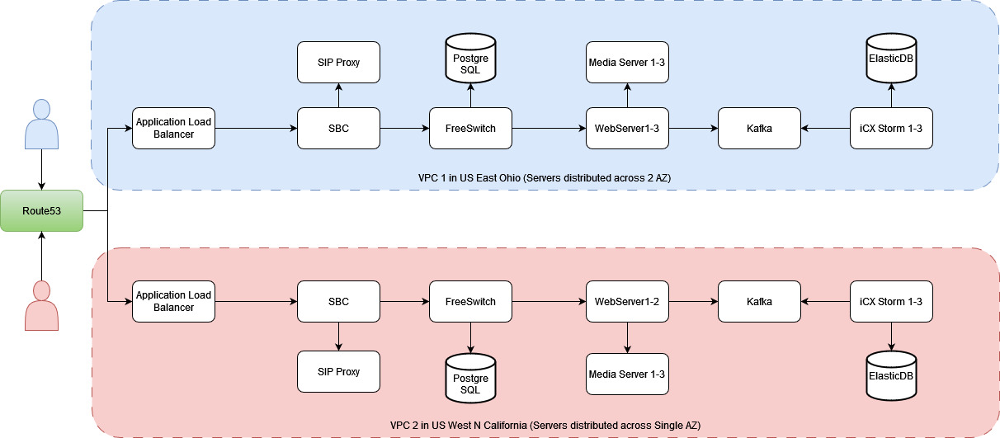

# Terraform - AWS - Production - Sample
This is a respository to demo creating resources required for a 3-Tier Web application on AWS using Terraform. This includes creation of Application Loadbalancer, EC2 instances, S3 Bucket, VPC, Subnets and Route Tables. 
Also in Terraform script we have used variables, modules, tfvars, AWS System and secret management, etc. 

The intent is to use this as base repository to create production resources. 

## Prerequisite
1. [Download](https://docs.aws.amazon.com/cli/latest/userguide/getting-started-install.html) and [configure](https://docs.aws.amazon.com/cli/latest/userguide/getting-started-quickstart.html) AWS CLI for your AWS Account. 
2. [Download](https://git-scm.com/downloads) Git. 
3. [Download](https://developer.hashicorp.com/terraform/install?product_intent=terraform) and install Terraform. 

## Steps
1. Download the repository and go to the base folder 

    `cd terraform-aws-prod-sample`
2. Initialize terraform

    `terraform init`
3. Verify resource creation
    
    `terraform plan`
4. Create resources in AWS
    
    `terraform apply`

## Architecture

## To Do List
1. Update Readme. 

## Notes

[def]: <architecture/prod.jpeg>